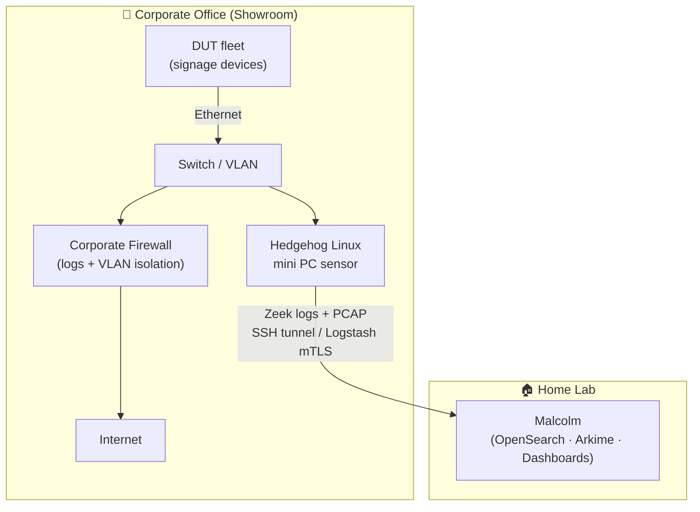
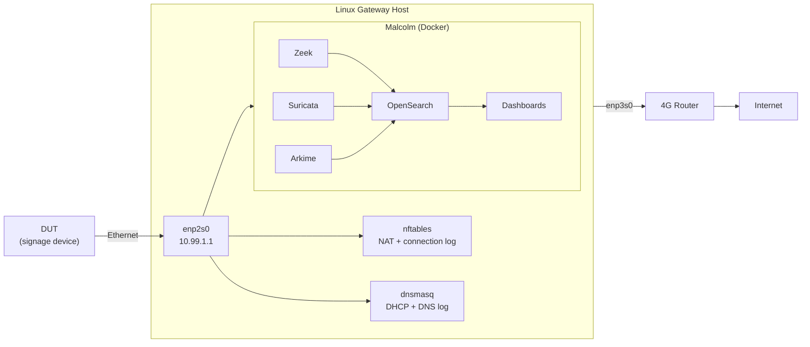
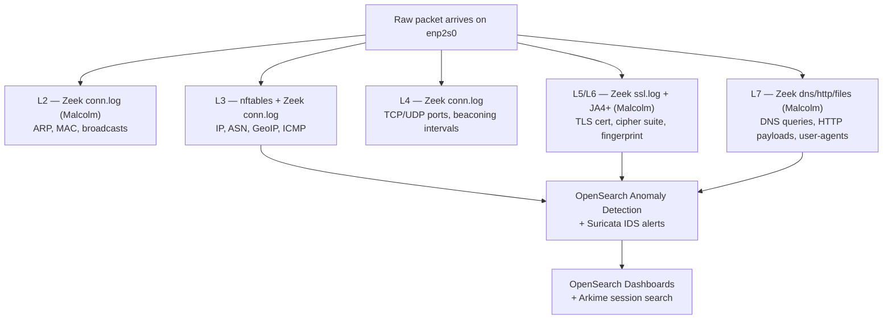
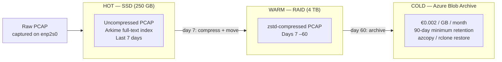
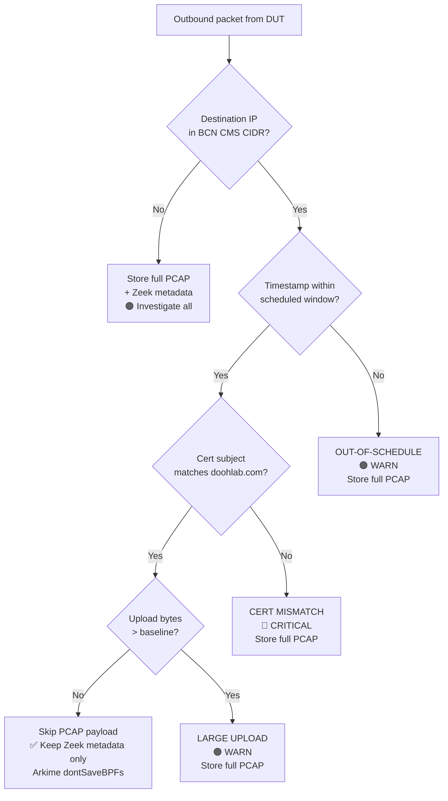

# Test Lab Environment Setup Guide

**Purpose:** Step-by-step setup of the isolated test lab infrastructure

---

## Testing Sites

Two physical locations are used in this project. Both are Ethernet-only — no WiFi is used for device connectivity at either site.

| Site | Devices | Infrastructure | Internet uplink |
|------|---------|----------------|-----------------|
| **Corporate office (showroom)** | Main fleet under test | Corporate firewall + managed switch or Linux gateway | Corporate LAN → corp firewall → internet |
| **Home lab** | Subset of devices for detailed analysis | Linux box acting as gateway | 4G router (NAT, no WiFi) |

The **home lab** is the primary deep-analysis environment because it offers full control of the internet uplink and the Linux gateway machine. The **office showroom** is used for initial inventory, physical inspection, and long-running passive capture on the full device fleet.

**Corporate firewall — value for this project:**

The corporate firewall at the office site is a significant asset. Coordinate with IT/NOC to leverage the following:

- **Firewall logs** — request access to outbound connection logs for the VLAN or switch port segment where the signage devices are connected. These logs are independent of any monitoring you run on-device or on the Linux gateway, providing a second source of truth.
- **DNS query logging** — if the corporate DNS resolver logs queries, those records will show all hostnames the devices attempt to resolve, even if the connection itself is encrypted.
- **Geo-blocking visibility** — the firewall may already flag or block connections to certain country-code IP ranges. Check whether any signage device traffic triggers existing geo-block rules.
- **Traffic isolation** — ask IT to place the signage devices on a dedicated VLAN or firewall zone so their traffic is trivially separable from other office traffic in the logs.
- **Alert forwarding** — if the firewall feeds a SIEM, request that alerts for the signage VLAN be routed to you for the duration of the test.

> **Office network path:** DUT → Ethernet → switch (showroom) → corporate LAN → **corporate firewall** → internet. The firewall sees all outbound traffic from the devices. No Linux gateway is strictly required at the office site if firewall log access is granted — the gateway is optional here for additional PCAP depth.

> **Home lab network path:** DUT → Ethernet → Linux gateway (enp2s0) → Linux gateway (enp3s0) → 4G router (Ethernet WAN port) → 4G mobile internet. Every packet passes through the Linux host before hitting the 4G router. The 4G router needs no special configuration.

---

## Hedgehog Linux — Remote Sensor at the Office Site

[Hedgehog Linux](https://github.com/cisagov/Malcolm/tree/main/hedgehog) is a companion project to Malcolm, also from CISA/INL (Apache 2.0). It is a purpose-built, hardened Linux sensor OS designed to run on a small dedicated machine (e.g. a mini PC) at a remote site — in this case the corporate showroom. Hedgehog captures traffic and ships it back to your Malcolm instance at the home lab, giving you unified analysis across both sites in one OpenSearch/Arkime interface.

**Why this matters for this project:**

- The corporate firewall already provides independent log evidence. Hedgehog adds full PCAP depth and Zeek metadata from the office network without requiring a second Malcolm installation.
- Hedgehog is deliberately minimal — no GUI, no unnecessary services. It boots straight into capture mode.
- Traffic forwarding between Hedgehog and Malcolm is authenticated and optionally encrypted (SSH tunnel or Logstash mutual TLS).

### Office site architecture with Hedgehog



### Hedgehog setup outline

1. **Download the Hedgehog ISO** from the [Malcolm releases page](https://github.com/cisagov/Malcolm/releases) — look for `hedgehog-*.iso`.
2. **Write to USB** and boot the mini PC from it. The installer asks for:
   - Capture interface (NIC facing the showroom switch mirror port)
   - Malcolm server IP/hostname and credentials
   - Forwarding method (Logstash over mTLS is the default; SSH reverse tunnel is also supported)
3. **On the switch**, configure a mirror/SPAN port that sends a copy of all traffic from the signage device ports to the Hedgehog capture NIC.
4. **On Malcolm** (home lab), run `./scripts/auth_setup` and create a Hedgehog sensor credential. Restart Malcolm services after.
5. Within a few minutes, Hedgehog sessions appear in the Malcolm Arkime interface tagged with the sensor hostname, distinguishable from the home lab captures.

> Hedgehog does **not** require a second NIC for WAN access — it only needs its capture NIC (mirror port) and a management/uplink NIC to reach Malcolm over the internet (via the corporate firewall outbound). Ensure the corporate firewall allows outbound TCP 5044 (Logstash) or whichever forwarding port you configure.

---

## Architecture Overview

The lab uses a Linux gateway host with Malcolm as the analysis backend. All DUT traffic passes through the Linux host before reaching the internet.

### Linux Gateway + Malcolm

```text
  [Device Under Test (DUT)]
          │  (Ethernet only)
          │
  ┌───────┴──────────────────────────────────────────────────────────────┐
  │                  LINUX GATEWAY HOST (2 NICs)                          │
  │                                                                        │
  │   NIC 1: enp2s0  ←── DUT-facing (10.99.1.1/24)                      │
  │   NIC 2: enp3s0  ──→  WAN / uplink (4G router)                       │
  │                                                                        │
  │   ── Network infrastructure (Linux, always-on) ──                     │
  │   ├── dnsmasq          DHCP + DNS logging                             │
  │   └── nftables         NAT + per-connection logging (monitor-only)    │
  │                                                                        │
  │   ── Analysis backend (Malcolm Docker stack) ──                       │
  │   ├── Zeek             Live protocol analysis (conn/dns/ssl/http/...)  │
  │   ├── Suricata         IDS signature alerts                           │
  │   ├── Arkime           Full PCAP storage + browser-based session search│
  │   ├── OpenSearch       Log indexing + anomaly detection (ML)          │
  │   └── Dashboards       40+ prebuilt dashboards, alerting, GeoIP       │
  └────────────────────────────────────────────────────────────────────────┘
          │
  [Internet] — full access, all traffic logged
```

All device traffic is **forced through the Linux host** at L3. Malcolm runs as Docker containers on the same host and listens on `enp2s0` — no separate analysis machine needed. The infrastructure layer (`dnsmasq`, `nftables`) runs on the host OS alongside the Docker stack.



---

## Linux Gateway Setup

**Hardware needed:** Any Linux PC or mini PC with two NICs. Both the DUT and the gateway communicate over Ethernet — no WiFi involved.
**OS:** Ubuntu 24.04 LTS or Debian 12.
**Assumed interface names:** `enp2s0` = DUT-facing LAN (Ethernet cable from device), `enp3s0` = WAN/uplink.

**Home lab WAN uplink:** `enp3s0` connects by Ethernet to the 4G router's LAN port. The 4G router handles mobile internet — no configuration changes are needed on the router itself. Keep the router's NAT and DHCP active; the Linux gateway sits between it and the DUTs.

```text
  [DUT] ──Ethernet──▶ enp2s0 [LINUX GATEWAY] enp3s0 ──Ethernet──▶ [4G ROUTER] ──▶ Internet
```

> **Note:** Devices in this initial batch are Ethernet-only (no WiFi). This means there is exactly one network path from device to internet — through `enp2s0` on the Linux gateway. All traffic is visible on that single interface with no risk of a parallel WiFi egress path.

### B.1 — Basic IP Forwarding & NAT

```bash
# Enable IP forwarding permanently
echo "net.ipv4.ip_forward=1" | sudo tee /etc/sysctl.d/99-ip-forward.conf
sudo sysctl -p /etc/sysctl.d/99-ip-forward.conf

# Assign static IP to DUT-facing NIC
sudo ip addr add 10.99.1.1/24 dev enp2s0
sudo ip link set enp2s0 up

# Basic NAT so DUT can reach internet via WAN NIC
sudo iptables -t nat -A POSTROUTING -o enp3s0 -j MASQUERADE
sudo iptables -A FORWARD -i enp2s0 -o enp3s0 -j ACCEPT
sudo iptables -A FORWARD -i enp3s0 -o enp2s0 -m state --state RELATED,ESTABLISHED -j ACCEPT
```

Make the iptables rules survive reboot:

```bash
sudo apt install iptables-persistent -y
sudo netfilter-persistent save
```

### B.2 — nftables: NAT + Full Connection Logging (monitor-only)

> **Monitoring only** — all traffic is allowed and forwarded. The goal is to observe unmodified device behavior. Blocking is done only in the customer deployment firewall, not here.

```bash
sudo apt install nftables -y
sudo systemctl enable nftables
```

Create `/etc/nftables.conf`:

```nft
#!/usr/sbin/nft -f
flush ruleset

table ip nat {
    chain postrouting {
        type nat hook postrouting priority srcnat;
        # NAT all DUT traffic out through WAN NIC
        oifname "enp3s0" masquerade
    }
}

table ip monitor {
    chain forward {
        type filter hook forward priority 0; policy accept;

        # Log every outbound connection from DUT — new connections only
        ip saddr 10.99.1.100 ct state new \
          log prefix "DUT-OUTBOUND: " flags all

        # Log every inbound connection to DUT
        ip daddr 10.99.1.100 ct state new \
          log prefix "DUT-INBOUND: "  flags all
    }
}
```

```bash
sudo nft -f /etc/nftables.conf

# Verify rules loaded
sudo nft list ruleset

# Watch live connection log
sudo journalctl -f -k | grep "DUT-"

# Save to file for later analysis
sudo journalctl -k | grep "DUT-OUTBOUND" > /logs/nftables-connections.log
```

### B.3 — Chinese IP / GeoIP Analysis

Malcolm includes MaxMind GeoLite2 built in. Use the **Connections by Country** dashboard in OpenSearch Dashboards to identify traffic to Chinese ASNs and IP ranges — no separate script or IP list download needed.

Flag any connection where `GeoIP country == CN` and the destination is not a known CDN as a 🔴 CRITICAL finding for investigation.

### B.4 — dnsmasq as DHCP + DNS Logger

```bash
sudo apt install dnsmasq -y
```

Edit `/etc/dnsmasq.conf`:

```ini
# Only listen on DUT-facing NIC
interface=enp2s0
bind-interfaces

# DHCP range — static lease for device
dhcp-range=10.99.1.100,10.99.1.200,12h
dhcp-host=AA:BB:CC:DD:EE:FF,device-under-test,10.99.1.100

# Force all DNS through this host
# Upstream resolver (use your preferred one, or local unbound)
server=8.8.8.8

# Log ALL queries with timestamps
log-queries=extra
log-facility=/var/log/dnsmasq.log

# Set this host as NTP server for device
dhcp-option=42,10.99.1.1
```

```bash
sudo systemctl restart dnsmasq

# Live DNS query monitoring
sudo tail -f /var/log/dnsmasq.log | grep "10.99.1.100"

# Detect (but do NOT block) DNS queries bypassing dnsmasq to a hardcoded resolver
# These will appear in the nftables log as DUT-OUTBOUND on port 53 to a non-10.99.1.1 destination
# Look for them with:
sudo journalctl -k | grep 'DUT-OUTBOUND' | grep 'dport 53'
```

> **Important:** If the device sends DNS queries to an IP other than `10.99.1.1`, this means it has a hardcoded resolver (common in Chinese firmware). Do not block it — document the destination IP and capture the queries with Zeek/tcpdump.

### B.6 — Zeek Log Analysis (via Malcolm)

Malcolm runs Zeek internally and stores all logs under `/opt/malcolm/zeek-logs/current/` on the gateway host. Use the OpenSearch Dashboards interface for interactive filtering. For scripted analysis, `zeek-cut` can be run directly against Malcolm’s log files:

```bash
# All unique external IPs the device connected to
zeek-cut id.resp_h < /opt/malcolm/zeek-logs/current/conn.log | \
  grep -v "^10\." | sort | uniq -c | sort -rn

# Total bytes sent per destination IP
zeek-cut id.resp_h orig_bytes < /opt/malcolm/zeek-logs/current/conn.log | \
  awk '{sum[$1]+=$2} END {for(ip in sum) print sum[ip], ip}' | \
  sort -rn | head 20

# All domains resolved
zeek-cut query < /opt/malcolm/zeek-logs/current/dns.log | sort | uniq -c | sort -rn

# TLS certificate subjects seen
zeek-cut server_name certificate.subject < /opt/malcolm/zeek-logs/current/ssl.log | sort | uniq

# Anomalies and protocol errors
zeek-cut ts id.orig_h id.resp_h name msg < /opt/malcolm/zeek-logs/current/weird.log
```

### B.9 — Alternate Egress Path Risk (Ethernet-only devices)

Devices in this batch are **Ethernet-only** — no WiFi chip. This eliminates the WiFi/Ethernet bridge risk and means there is a single, fully monitored network path through `enp2s0`. However, two secondary egress vectors are still worth checking:

#### Static IP Assignment (bypassing DHCP)

A rooted device could ignore DHCP and assign itself a hardcoded static IP, either on the same subnet or a different one entirely, and attempt to reach a hardcoded gateway.

```bash
# Check what IP the device has actually configured
adb shell ip addr show eth0

# Check the routing table — does it use 10.99.1.1 as default gateway?
adb shell ip route show
# Expected: default via 10.99.1.1 dev eth0
# Flag if: any other gateway IP or any additional route entry
```

- [ ] Device uses DHCP and respects assigned gateway: ⚪ LOG — normal
- [ ] Device assigns itself a **static IP** without DHCP: 🟠 WARN — hardcoded network target
- [ ] Device sets a **different default gateway**: 🔴 CRITICAL — traffic will not pass through your monitoring host

> If a device bypasses your gateway via static routes, traffic will not appear in Zeek or nftables logs at all. Verify with ADB after every reboot that the routing table still points to `10.99.1.1`.

#### USB Tethering as a Secondary Egress Path

Even without WiFi, a rooted device can silently accept USB tethering from a connected phone and use the phone's mobile data connection — completely bypassing the Ethernet gateway.

**Rule: do not connect any phone or USB device to the DUT during testing unless it is part of a specific test case.**

```bash
# Check current tethering state
adb shell dumpsys connectivity | grep -i tether

# Check USB config — should be 'adb' only, not 'rndis' (rndis = USB tethering)
adb shell getprop persist.sys.usb.config
# Flag if output contains 'rndis'

# Check if any app has MANAGE_USB permission
grep -i "MANAGE_USB\|CHANGE_NETWORK_STATE\|MANAGE_NETWORK_POLICY" dumpsys_package.txt
```

| Observation | Severity | Meaning |
|---|---|---|
| DHCP used, gateway is `10.99.1.1`, single route | ⚪ LOG | Expected — all traffic monitored |
| Device assigns itself a static IP | 🟠 WARN | Hardcoded network knowledge |
| Default gateway is not `10.99.1.1` | 🔴 CRITICAL | Traffic bypasses monitoring entirely |
| USB config includes `rndis` | 🟠 WARN | USB tethering enabled — do not plug phones in |
| USB tethering activates automatically on USB connect | 🔴 CRITICAL | Second egress path via phone mobile data |

---

### B.11 — OSI Layer Coverage Summary

| OSI Layer | Tool | What Is Captured |
|---|---|---|
| L2 — Data Link | Arkime PCAP (Malcolm) | ARP, MAC addresses, broadcast storms |
| L3 — Network | nftables logs, Zeek `conn.log` | IP geolocation, ASN, ICMP, routing anomalies |
| L4 — Transport | Zeek `conn.log`, nftables | TCP/UDP ports, connection state, beaconing intervals |
| L5/L6 — Session/Presentation | Zeek `ssl.log` + JA4+ (Malcolm) | TLS cert inspection, cipher suites, certificate pinning |
| L7 — Application | Zeek `dns.log` `http.log` (Malcolm) | DNS queries, HTTP payloads, user-agents, API calls, uploaded data |

All layers are visible **before NAT** on `enp2s0` — this is the key advantage of the Linux gateway over router-only logging.



---

### B.10 — Malcolm: Integrated Analysis Backend

[Malcolm](https://github.com/cisagov/Malcolm) (CISA / Idaho National Lab, Apache 2.0) replaces the manually assembled Zeek + tcpdump + Elasticsearch + Kibana stack with a single pre-wired Docker Compose deployment. It adds Suricata IDS, Arkime full-PCAP browser, OpenSearch anomaly detection, DGA/entropy detection, YARA file scanning, threat intel feed integration, and 40+ prebuilt dashboards — all configured out of the box.

**What Malcolm replaces from the individual-component plan:**

| Individual component | Malcolm equivalent |
|---|---|
| `tcpdump` rotating PCAP | Arkime capture (PCAP stored + indexed) |
| Zeek (manual) | Zeek (pre-configured, 30+ protocol parsers) |
| ❌ none | Suricata IDS — signature-based alerts |
| Kibana (manual dashboards) | OpenSearch Dashboards — 40+ prebuilt dashboards |
| Manual log parsing | Logstash + Filebeat pipelines, all pre-wired |
| ❌ none | JA4+ TLS fingerprinting (via Zeek plugin) |
| ❌ none | freq server — entropy/DGA detection on DNS queries |
| ❌ none | MISP/TAXII threat intel auto-correlation |
| ❌ none | Strelka file scanner (YARA + Capa + ClamAV) |
| Manual GeoIP | MaxMind GeoLite2 built-in |

**What Malcolm does NOT replace (keep running on the host OS):**

- `dnsmasq` — DHCP server and DNS logger for the DUT subnet
- `nftables` — NAT and per-connection kernel-level logging

#### B.10.1 — Hardware Requirements

Malcolm is heavier than individual tools. Minimum for a single-device lab:

| Resource | Minimum | Recommended |
|---|---|---|
| RAM | 16 GB | 32 GB |
| CPU | 4 cores | 8 cores |
| Storage | 250 GB SSD | 500 GB+ SSD |
| OS | Ubuntu 22.04/24.04, Debian 12 | same |

**Storage tiering** — PCAP and index data grows quickly. A three-tier approach keeps costs manageable:



#### B.10.2 — Installation

```bash
# Install Docker
curl -fsSL https://get.docker.com | sudo sh
sudo usermod -aG docker $USER
newgrp docker

# Clone Malcolm
git clone --depth 1 https://github.com/cisagov/Malcolm.git
cd Malcolm

# Run the interactive setup wizard
# Accept defaults where unsure; key choices:
#   - capture interface: enp2s0
#   - live capture: yes
#   - Suricata: yes
python3 scripts/install.py

# Pull container images (~10–15 GB, takes time on first run)
docker compose pull

# Start Malcolm
docker compose up -d
```

Malcolm's web UI is available at `https://localhost` after startup (self-signed cert, accept the warning).
Default credentials are set during `install.py`.

#### B.10.3 — Point Malcolm at the DUT Interface

During `install.py` or by editing `malcolm-environment.env`:

```bash
# In malcolm-environment.env:
PCAP_IFACE=enp2s0          # capture on DUT-facing NIC
ZEEK_LIVE_CAPTURE=true
SURICATA_LIVE_CAPTURE=true
```

Malcolm's Zeek and Suricata containers will attach directly to `enp2s0` and begin capturing. No tcpdump wrapper needed — Arkime stores and indexes the raw PCAP automatically.

#### B.10.4 — Key Dashboards for This Use Case

Once Malcolm is running, open the OpenSearch Dashboards interface (linked from the main Malcolm UI) and look at:

| Dashboard | What to watch |
|---|---|
| **Connections** | Destination IPs, countries, ASNs — filter by `enp2s0` source |
| **DNS** | All queried domains, especially those not matching known CDN patterns |
| **TLS** | Certificate subjects, issuers, JA4+ fingerprints, expired/self-signed certs |
| **Suricata Alerts** | Any signature hits — even low-severity ones are worth noting |
| **File Transfers** | Zeek-extracted files scanned by Strelka/YARA |
| **Connections by Country** | GeoIP map — flag any Chinese ASN traffic |

#### B.10.5 — Uploading Offline PCAPs

If you capture a PCAP elsewhere (e.g., at the office with tcpdump), upload it to Malcolm for indexing:

```bash
# Via the Malcolm web UI → Upload PCAP / Zeek logs
# Or via the upload container directly:
curl -u analyst:password -F "filedata=@/path/to/capture.pcap" \
  https://localhost/upload
```

Malcolm will process the PCAP through Zeek, Suricata, and Arkime and add it to the searchable index — making it possible to correlate office captures with home lab captures in one interface.

---

### B.12 — Known-Good Traffic Filtering (BCN CMS + Schedule-Aware Analysis)

#### B.12.1 — Why Filter CMS Traffic from PCAP Storage (But Never from Metadata)

Content delivery from Doohlab BCN is the highest-volume traffic source — potentially 80%+ of total bytes. Storing full PCAP for it wastes storage without adding security value.

**Rule: filter CMS traffic from PCAP payload storage only. Never filter it from Zeek logs or connection metadata.** The connection still appears in `conn.log`, `ssl.log`, and dashboards — only the raw packet bytes are not saved.

Risks that only show up in CMS traffic metadata (reasons to keep watching it):

- **Data piggybacking** — exfil payload embedded in a content sync request (upload bytes to CMS endpoint much larger than expected)
- **DNS substitution** — device resolves `bcn.doohlab.com` but connects to a different IP than BCN's known CIDR
- **TLS certificate mismatch** — cert subject in `ssl.log` does not match `*.doohlab.com`
- **Out-of-schedule connections** — device contacts CMS at a time when no content is scheduled (see B.12.3)

#### B.12.2 — Arkime PCAP Filter for Known-Good CMS Traffic

First, resolve and document BCN's origin IP ranges. Update this list whenever BCN infrastructure changes:

```bash
# /etc/known-good-cidrs.conf
# Doohlab BCN CMS — update with real IPs from DNS/NOC
# dig +short bcn.doohlab.com
# Check with your BCN account contact for full CDN/origin CIDR list
BCN_CIDRS="203.0.113.0/24"    # placeholder — replace with real BCN CIDRs
```

Add the filter to Arkime's config so it skips PCAP storage for matching sessions
while still indexing session metadata:

```ini
# /opt/malcolm/config/arkime.ini  (or arkime/config/config.ini in Malcolm)

# Drop PCAP payload for known-good CMS traffic
# Metadata (conn.log, ssl.log, session record) is still indexed — only bytes not stored
dontSaveBPFs=dst net 203.0.113.0/24;1
# Format: <BPF expression>;<sampleRate>
# sampleRate 1 = drop 100% of matching session PCAPs
# Add more semicolon-separated rules for additional known-good CIDRs:
# dontSaveBPFs=dst net 203.0.113.0/24;1 or dst net 198.51.100.0/24;1
```

Restart Arkime capture after editing:

```bash
cd /opt/malcolm
docker compose restart arkime
```

#### B.12.3 — Schedule-Aware Anomaly Detection

Because content is scheduled in BCN UI, you have a ground-truth timetable of when the devices *should* be downloading content. Any CMS connection outside that window is suspicious.

**Step 1 — Export the content schedule from BCN**

Export or manually record the scheduled delivery windows for each device (or device group) as a simple CSV:

```text
# /etc/bcn-schedule.csv
# device_mac, window_start (HH:MM UTC), window_end (HH:MM UTC), days (mon-fri / daily / etc)
AA:BB:CC:DD:EE:01, 06:00, 08:00, daily
AA:BB:CC:DD:EE:01, 14:00, 15:00, mon-fri
AA:BB:CC:DD:EE:02, 07:00, 09:00, daily
```

**Step 2 — Cross-reference Zeek `conn.log` against the schedule**

Run this after each capture day:

```python
#!/usr/bin/env python3
# check-bcn-schedule.py — flag CMS connections outside scheduled windows
import csv
import sys
from datetime import datetime, time

BCN_CIDRS = ["203.0.113.0/24"]  # replace with real BCN CIDRs
SCHEDULE_FILE = "/etc/bcn-schedule.csv"

import ipaddress
bcn_nets = [ipaddress.ip_network(c) for c in BCN_CIDRS]

def is_bcn(ip):
    try:
        addr = ipaddress.ip_address(ip)
        return any(addr in net for net in bcn_nets)
    except ValueError:
        return False

def in_window(ts, start_str, end_str):
    t = datetime.utcfromtimestamp(float(ts)).time()
    s = time.fromisoformat(start_str)
    e = time.fromisoformat(end_str)
    return s <= t <= e

# Load schedule: {mac: [(start, end, days), ...]}
schedule = {}
with open(SCHEDULE_FILE) as f:
    for row in csv.reader(f):
        if not row or row[0].startswith("#"):
            continue
        mac, start, end, days = [x.strip() for x in row]
        schedule.setdefault(mac.lower(), []).append((start, end, days))

# Read zeek conn.log from stdin (zeek-cut ts id.orig_h id.resp_h)
# Usage: zeek-cut ts id.orig_h id.resp_h < conn.log | python3 check-bcn-schedule.py
for line in sys.stdin:
    parts = line.strip().split("\t")
    if len(parts) < 3:
        continue
    ts, src, dst = parts[0], parts[1], parts[2]
    if not is_bcn(dst):
        continue
    # Find device MAC from ARP/DHCP log or use IP as proxy
    # For simplicity, match by source IP mapped to MAC via dnsmasq lease
    matched_window = False
    for mac, windows in schedule.items():
        for start, end, days in windows:
            if in_window(ts, start, end):
                matched_window = True
                break
    if not matched_window:
        dt = datetime.utcfromtimestamp(float(ts)).strftime("%Y-%m-%d %H:%M:%S UTC")
        print(f"[OUT-OF-SCHEDULE] {dt}  {src} → {dst}  (CMS contact outside any scheduled window)")
```

Run daily:

```bash
zeek-cut ts id.orig_h id.resp_h < /opt/malcolm/zeek-logs/current/conn.log | \
  python3 /opt/scripts/check-bcn-schedule.py >> /logs/schedule-anomalies.log
```

Any `[OUT-OF-SCHEDULE]` line is a 🟠 WARN finding — investigate whether it was a legitimate background sync (BCN may do health checks), an unscheduled firmware pull, or unexpected exfil.

#### B.12.4 — CMS Traffic Integrity Checks (Always-On)

These checks run against Zeek metadata regardless of PCAP filtering:

```bash
# 1. BCN destination IP is inside known CIDR (flag anything going elsewhere)
zeek-cut id.resp_h < conn.log | sort -u | while read ip; do
  python3 -c "
import ipaddress, sys
nets = [ipaddress.ip_network('203.0.113.0/24')]  # replace
ip = ipaddress.ip_address('$ip')
if not any(ip in n for n in nets):
    print(f'[UNEXPECTED-CMS-IP] $ip')
"
done

# 2. TLS cert subject matches BCN domain
zeek-cut server_name certificate.subject < ssl.log | \
  grep -v "doohlab.com" | \
  grep -i "bcn\|cms\|content" | \
  awk '{print "[CERT-MISMATCH]", $0}'

# 3. Upload bytes to CMS endpoint above baseline (flag > 1 MB upload to CMS)
zeek-cut id.resp_h orig_bytes < conn.log | awk -v threshold=1048576 '
  $2 > threshold {print "[LARGE-UPLOAD-TO-CMS]", $1, $2, "bytes"}'
```

#### B.12.5 — Summary: What to Store and What to Skip

| Traffic type | PCAP payload | Zeek metadata | Reason |
|---|---|---|---------|
| BCN CMS (in-schedule) | ❌ skip | ✅ keep | Known-good source; metadata sufficient |
| BCN CMS (out-of-schedule) | ✅ store | ✅ keep | Anomalous — full payload needed |
| All other destinations | ✅ store | ✅ keep | Unknown — full capture required |
| nftables / dnsmasq local | ❌ skip | ✅ keep | Management traffic, no exfil risk |



---

## ADB Workstation Setup

```bash
# Install Android SDK Platform Tools (Linux)
wget https://dl.google.com/android/repository/platform-tools-latest-linux.zip
unzip platform-tools-latest-linux.zip
export PATH=$PATH:$(pwd)/platform-tools

# Verify device connected
adb devices

# Enable verbose logging to file
adb logcat > /logs/logcat-$(date +%Y%m%d).log &

# Dump logcat with timestamps
adb logcat -v time > /logs/logcat-timestamped-$(date +%Y%m%d).log &
```

### MobSF (Mobile Security Framework) — Docker

```bash
docker run -it --rm \
  -p 8000:8000 \
  -v /tmp/mobsf/:/home/mobsf/.MobSF \
  opensecurity/mobile-security-framework-mobsf:latest

# Access at http://localhost:8000
# Upload APK files for automated analysis
# Key sections to review:
#   - MANIFEST analysis (permissions)
#   - Network security config
#   - Hardcoded secrets
#   - API endpoint scan
#   - VirusTotal scan (disable if APK may contain customer data)
```

---

## Baseline Documentation Scripts

Run these and save output before each test phase:

```bash
#!/bin/bash
# baseline.sh — run at start of each phase, saves to ./baseline/YYYYMMDD/

DATE=$(date +%Y%m%d_%H%M)
DIR="./baseline/$DATE"
mkdir -p "$DIR"

echo "[*] Collecting device baseline..."

adb shell pm list packages -f > "$DIR/packages_full.txt"
adb shell pm list packages -s > "$DIR/packages_system.txt"
adb shell pm list packages -U > "$DIR/packages_uid.txt"
adb shell dumpsys package > "$DIR/dumpsys_package.txt"
adb shell dumpsys activity services > "$DIR/running_services.txt"
adb shell dumpsys jobscheduler > "$DIR/scheduled_jobs.txt"
adb shell ss -tlnp > "$DIR/listening_ports.txt"
adb shell getprop > "$DIR/getprop.txt"
adb shell ls -la /system/app/ > "$DIR/system_apps.txt"
adb shell ls -la /system/priv-app/ > "$DIR/system_priv_apps.txt"
adb shell ls -la /data/adb/ 2>/dev/null > "$DIR/magisk_modules.txt"
adb shell settings get secure android_id > "$DIR/android_id.txt"
adb shell getprop ro.serialno > "$DIR/serial.txt"

echo "[*] Baseline saved to $DIR"
echo "[*] Diff against previous baseline:"
if [ -d "./baseline/previous" ]; then
    diff -r ./baseline/previous "$DIR"
fi

# Update 'previous' symlink
rm -f ./baseline/previous
ln -s "$DIR" ./baseline/previous
```

---

## Quick Reference Commands

```bash
# Find all connections from device today in Zeek
grep "10.99.1.100" /opt/malcolm/zeek-logs/current/conn.log | \
  grep -v "10.99.1." | \
  awk '{print $5}' | sort | uniq -c | sort -rn

# Find all domains resolved by device today
grep "10.99.1.100" /opt/malcolm/zeek-logs/current/dns.log | \
  awk '{print $10}' | sort | uniq -c | sort -rn

# Check TLS certificates seen
grep "10.99.1.100" /opt/malcolm/zeek-logs/current/ssl.log | \
  awk '{print $9, $10, $15}' | sort | uniq

# Search PCAP for device serial number
tshark -r capture.pcap -Y "frame contains \"$(adb shell getprop ro.serialno | tr -d '\r')\""

# Volume by destination IP (top 10)
grep "10.99.1.100" /opt/malcolm/zeek-logs/current/conn.log | \
  awk '{sum[$5]+=$10} END {for(ip in sum) print sum[ip], ip}' | \
  sort -rn | head 10
```
