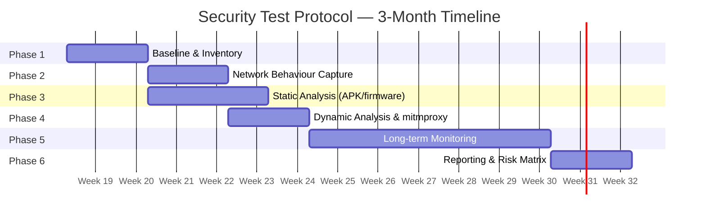
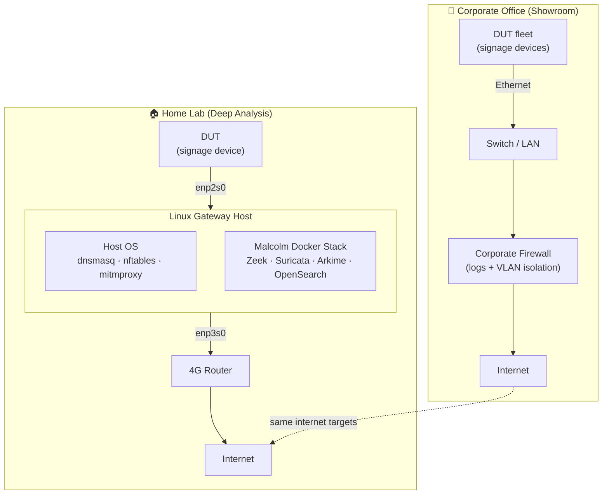

# Android Digital Signage — Security Test Protocol

A structured security evaluation protocol for Chinese-manufactured, rooted Android digital signage devices. The goal is to detect "calling home" behaviour, unauthorized data exfiltration, and other supply-chain security risks before or during deployment in a corporate environment.

---

## Context

- Devices are **Ethernet-only** (no WiFi), running **rooted Android** on Rockchip/Allwinner/MediaTek SoCs
- Testing is conducted across two sites:
  - **Corporate office showroom** — full device fleet, corporate firewall provides independent log source
  - **Home lab** — Linux gateway + 4G router, used for deep per-device traffic analysis
- All monitoring is **passive** (no traffic blocking during the test phase)

---

## Documents

| File | Purpose |
|------|---------|
| [TEST-PROTOCOL.md](TEST-PROTOCOL.md) | Main 6-phase test protocol — threat model, test procedures, risk matrix, appendices |
| [LAB-SETUP-GUIDE.md](LAB-SETUP-GUIDE.md) | Step-by-step Linux gateway setup (nftables, mitmproxy, Zeek, tcpdump, dnsmasq) |
| [TRAFFIC-ANALYSIS-CHECKLIST.md](TRAFFIC-ANALYSIS-CHECKLIST.md) | Daily/weekly analyst checklist with severity codes |
| [DEVICE-TEST-LOG-TEMPLATE.md](DEVICE-TEST-LOG-TEMPLATE.md) | Per-device tracking log — copy one per device under test |

---

## Test Phases Summary

| Phase | Duration | Focus |
|-------|----------|-------|
| 1 — Baseline & Inventory | Week 1–2 | Physical inspection, firmware fingerprint, ADB enumeration |
| 2 — Network Behaviour | Week 2–4 | Traffic capture, DNS analysis, TLS certificate inspection |
| 3 — Static Analysis | Week 3–5 | APK decompilation, pre-installed app review, permission audit |
| 4 — Dynamic Analysis | Week 4–6 | Live traffic correlation, mitmproxy interception, Zeek alerts |
| 5 — Long-term Monitoring | Month 2–3 | Scheduled/overnight captures, job scheduler inspection, OTA watch |
| 6 — Reporting | Month 3 | Risk matrix, findings, recommendations |

---

## Lab Architecture

The Linux gateway runs two layers of tooling:

**Network infrastructure (host OS):**

- **nftables** — NAT + per-connection logging (monitor-only, policy accept)
- **dnsmasq** — DHCP server + DNS query logging
- **mitmproxy** — transparent HTTPS interception (TLS plaintext visible on rooted devices)

**Analysis backend ([Malcolm](https://github.com/cisagov/Malcolm) — Docker Compose, CISA/INL):**

- **Zeek** — live protocol analysis (conn, dns, ssl, http, files, weird logs)
- **Suricata** — IDS signature alerts
- **Arkime** — full PCAP storage + browser-based session search
- **OpenSearch + Dashboards** — log indexing, 40+ prebuilt dashboards, GeoIP, anomaly detection
- **Strelka** — YARA/Capa/ClamAV file scanning on Zeek-extracted files
- **JA4+** — TLS client fingerprinting via Zeek plugin
- **freq server** — entropy/DGA detection on DNS queries

Malcolm replaces manually wiring Zeek → Logstash → Elasticsearch → Kibana. It ships pre-configured with threat intel feed support (MISP/TAXII) and MaxMind GeoLite2 built in.

---

## Key Threat Areas

- Beaconing to Chinese CDN/cloud infrastructure (Alibaba, Tencent, ByteDance)
- Hardcoded DNS bypass (device ignoring DHCP-assigned resolver)
- Pre-installed spyware or adware SDKs (Adups, Umeng, Mintegral)
- Rogue CA certificates in system trust store
- Encrypted C2 channels using legitimate cloud services as cover
- OTA update mechanism pulling unsigned or unverified firmware
- USB tethering as a secondary egress path bypassing gateway monitoring

---

## Requirements

### Linux Gateway Host

- Ubuntu 22.04/24.04 LTS or Debian 12
- Two NICs: `enp2s0` (DUT-facing, 10.99.1.1/24) and `enp3s0` (WAN)
- **16 GB RAM minimum, 32 GB recommended** (Malcolm Docker stack)
- **250 GB+ SSD** for PCAP and log storage
- Host OS packages: `nftables`, `dnsmasq`, `mitmproxy`, `docker`
- Malcolm handles Zeek, Suricata, Arkime, and OpenSearch via Docker Compose

### Analyst Workstation

- Browser access to Malcolm UI at `https://<gateway-ip>` (OpenSearch Dashboards + Arkime)
- `adb`, `apktool`, `jadx`, `MobSF` (optional, for static analysis phases)

---

## Configuration Files

| File | Purpose |
|------|---------|
| [.markdownlint.json](.markdownlint.json) | Disables MD013 (line length) and MD060 (table style) for technical docs |
| [cspell.json](cspell.json) | Whitelists technical vocabulary for VS Code spell checker |

---

## License

This project is for internal security research and evaluation purposes.
